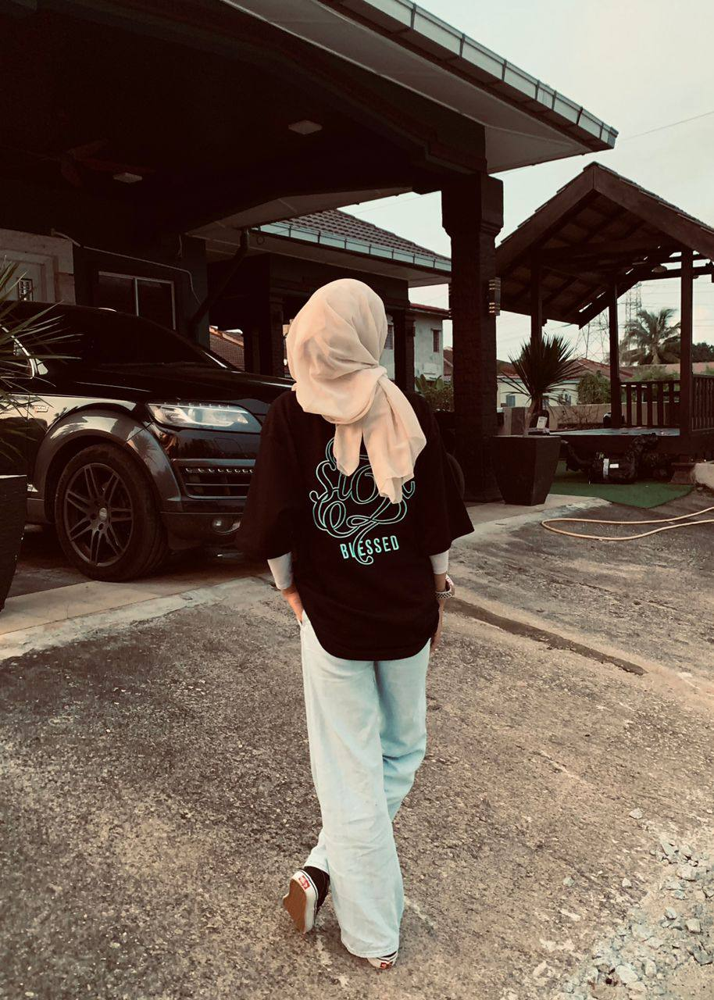
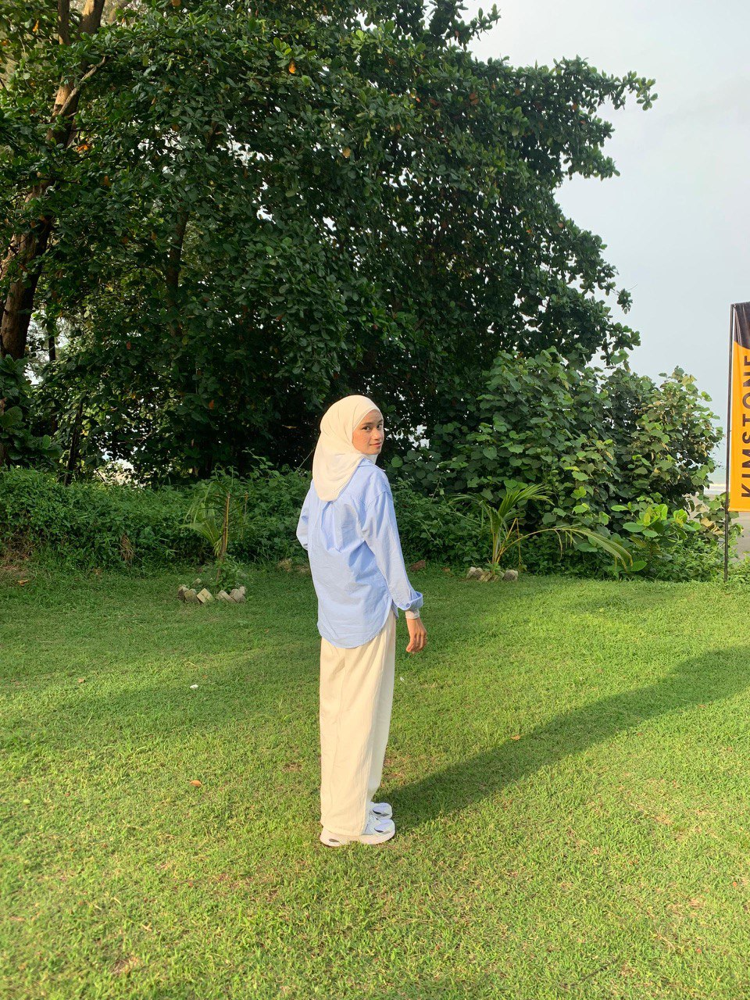
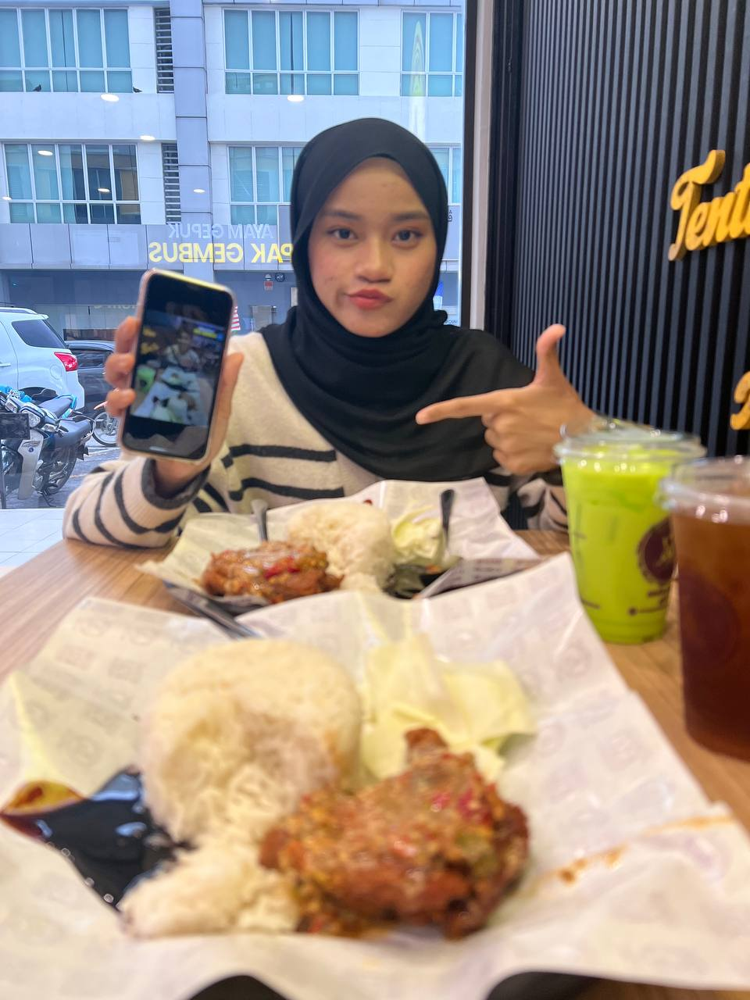
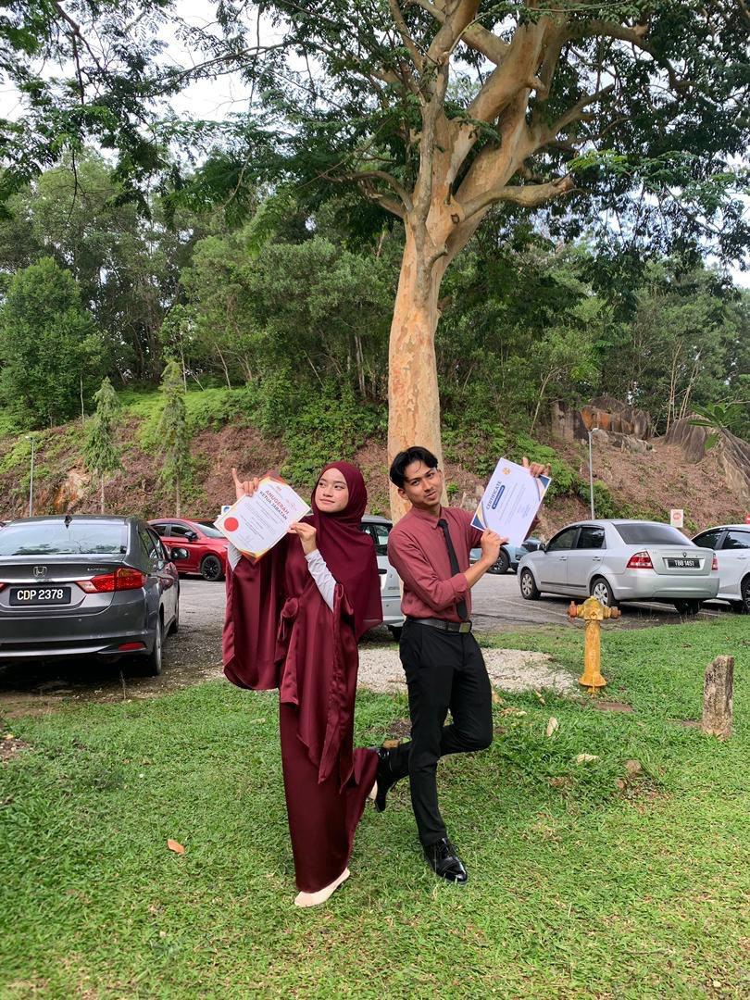

<html lang="ms">
<head>
<meta charset="UTF-8">
<meta name="viewport" content="width=device-width, initial-scale=1.0">
<title>Happy Birthday Shuraya 🎀🎉</title>

<link href="https://fonts.googleapis.com/css2?family=Quicksand:wght@400;600;700&display=swap" rel="stylesheet">

</head>

<body>

<!-- BACKGROUND MUSIC AUTOPLAY -->
<audio id="bgm" autoplay loop>
    <source src="https://github.com/ibrahimhafiez1-lgtm/HAPPY_BIRTHDAY_BABY/blob/main/happy_birthday_cute.mp3" type="audio/mpeg">
</audio>

<!-- LOCK SCREEN -->

    <h2>Happy Birthday, Shuraya 🎀</h2>
    
Website ni ada password. Tekan butang di bawah untuk masuk.

    <button class="btn" id="enterBtn">MASUK</button>

<!-- PASSWORD MODAL -->

    

        <button class="closeBtn" onclick="closePwd()">✕</button>
        <h3>Masukkan Password</h3>
        <input id="pwdInput" type="password" placeholder="Password" style="padding:10px;width:90%;margin-top:10px;border-radius:10px;border:2px solid #ffb3d9;">
          
        <button class="btn" id="pwdCheck">Buka</button>
        
Password default: <b>sayangsangat</b>

    

<!-- NAVIGATION -->

    <button onclick="showSection('home')">Home</button>
    <button onclick="showSection('slideshow')">Gambar</button>
    <button onclick="showSection('video')">Video</button>
    <button onclick="showSection('surat')">Surat</button>
    <button onclick="showSection('memory')">Memori</button>
    <button onclick="showSection('why')">Why You’re Special</button>
    <button onclick="showSection('wish')">Ucapan Panjang</button>

<!-- HOME -->
<section id="home" class="section">
    <h1 class="glow">Happy Birthday, NURUL SHURAYA 🎀💗</h1>
    <h3>23 November 2005</h3>
    
Hari ni hari istimewa untuk seorang yang bermakna… iaitu awak 💗

    <h2>🎀 Countdown Ke Birthday Shuraya</h2>
    <h1 id="countdown"></h1>

    <h3>🎶 Background Music</h3>
    <audio controls id="bgAudio">
        <source src="YOUR-SONG.mp3">
    </audio>
</section>

<!-- SLIDESHOW -->
<section id="slideshow" class="section" style="display:none">
    <h2>📸 Gambar Cantik Shuraya</h2>

    

        

            
        

        

            
        

        

            
        

        

            
        

    

    

        
        
        
        
    

</section>

<!-- VIDEO -->
<section id="video" class="section" style="display:none">
    <h2>🎥 Video Untuk Shuraya</h2>
    <video controls>
        <source src="video_2025-11-16_22-36-23.mp4" type="video/mp4">
    </video>
</section>

<!-- SURAT -->
<section id="surat" class="section" style="display:none">
    <h2>💌 Surat Untuk Shuraya</h2>
    

        Shuraya… awak sangat istimewa, lembut hati, kuat, dan berharga.
        Semoga hari lahir ni penuh kebahagiaan dan senyuman 💗
    

</section>

<!-- MEMORY -->
<section id="memory" class="section" style="display:none">
    <h2>📚 Memory Page</h2>
    
</section>

<!-- WHY -->
<section id="why" class="section" style="display:none">
    <h2>🌸 Kenapa Shuraya Istimewa</h2>
    <ul style="list-style:none;font-size:19px;line-height:2;">
        <li>• Awak baik hati 💗</li>
        <li>• Awak penyayang 🎀</li>
        <li>• Cantik luar & dalam 💞</li>
        <li>• Kuat walaupun pendam 💗</li>
        <li>• Buat orang rasa dihargai 🎀</li>
    </ul>
</section>

<!-- WISH -->
<section id="wish" class="section" style="display:none">
    <h2>🎂 Ucapan Panjang Untuk Shuraya</h2>
    

        Selamat Hari Lahir, Shuraya 🎀💗 Semoga hidup awak sentiasa dipenuhi kegembiraan.
    

</section>

</body>
</html>
